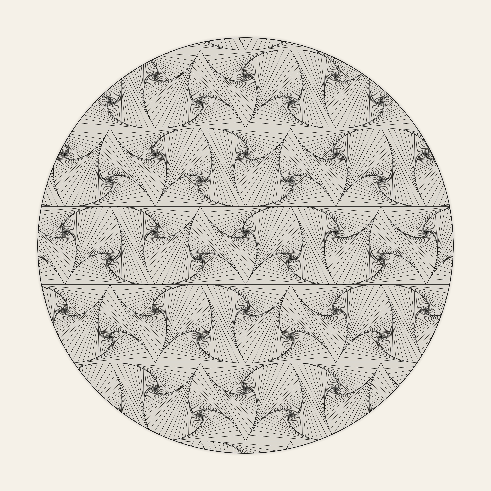

# Geometric Hallucination Patterns

Animated recursive geometry — nested squares and Zentangle Paradox spirals, inspired by form constants and pen-and-ink art.

**[Live demo — DMT Tunnel](https://raggedr.github.io/dmt/)** | **[Live demo — Zentangle Paradox](https://raggedr.github.io/dmt/zentangle-animated.html)**

## Zentangle Paradox

The Zentangle Paradox is a pen-and-ink technique where only straight lines create the illusion of smooth spiraling curves.

The algorithm: start with an equilateral triangle. Each iteration advances every vertex a fraction along its edge to produce a new, smaller, rotated triangle inside. After ~50 iterations, the cumulative rotation creates a logarithmic spiral — despite every single line being perfectly straight. Adjacent triangles in the tessellation spiral in opposite directions, creating the characteristic flowing meta-pattern.

The animated version (`zentangle-animated.html`) keeps the outer tessellation fixed and adds a time-varying rotation to each recursive contraction step. This accumulates — the n-th inner triangle gets n times the extra rotation — so the spiral cores wind and unwind while the grid stays rigid.

- `zentangle.html` — Static Zentangle Paradox pattern
- `zentangle-animated.html` — Animated version with oscillating inner rotation
- `zentangle.jpg` — High-resolution static render (4000x4000)

## DMT Tunnel

Four spiral vortices tile the screen in a 2x2 grid, each built from 80 nested squares that shrink by 5% per step with 3.5° of incremental rotation. The animation sweeps all squares through a uniform 93° rotation (cosine-eased) over a 20-second cycle, exploiting the square's 90° rotational symmetry for seamless looping.

Alternating clockwise/counter-clockwise rotation between adjacent quadrants produces the characteristic pinwheel symmetry.

- `index.html` — Live animated version (GitHub Pages)
- `dmt_3d.html` — Development version with parameter comments
- `dmt_pattern.py` — Original Python (PIL) static generator

## Background

The geometric patterns produced by nested-polygon constructions are closely related to **form constants** — the universal visual hallucination patterns described by:

- **Bressloff, Cowan, Golubitsky, Thomas & Wiener** (2001). *Geometric visual hallucinations, Euclidean symmetry and the functional architecture of striate cortex.* Philosophical Transactions of the Royal Society B, 356(1407), 299-330.

- **Bressloff, Cowan, Golubitsky, Thomas & Wiener** (2002). *What geometric visual hallucinations tell us about the visual cortex.* Neural Computation, 14(3), 473-491.

Their work showed that these patterns — spirals, tunnels, funnels, and cobwebs — arise naturally from Turing-type instabilities in the neural field equations of V1, with the symmetry group of the pattern determined by the Euclidean symmetry of the cortical connection architecture.

## Running locally

Open any `.html` file in a browser. No dependencies.
