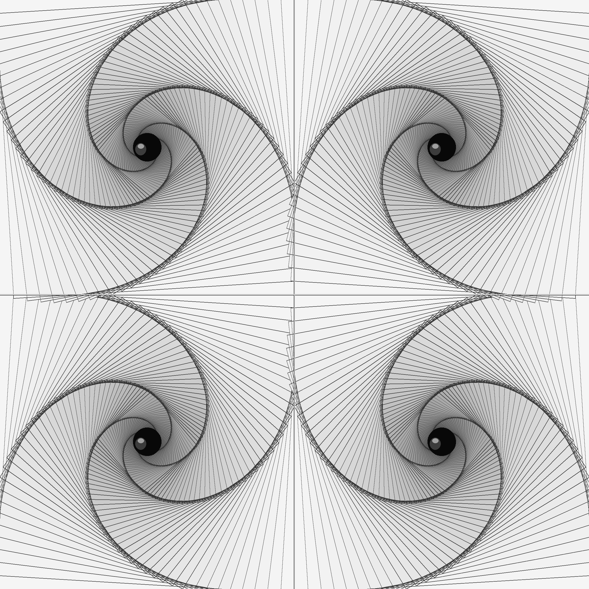

# DMT Tunnel — Geometric Hallucination Patterns

Animated recursive nested-square tunnels with 4-fold symmetry, inspired by the visual geometry of form constants.

**[Live demo](https://raggedr.github.io/dmt/)**



## What it does

Four spiral vortices tile the screen in a 2x2 grid, each built from 80 nested squares that shrink by 5% per step with 3.5° of incremental rotation. The animation sweeps all squares through a uniform 93° rotation (cosine-eased) over a 20-second cycle, exploiting the square's 90° rotational symmetry for seamless looping.

Alternating clockwise/counter-clockwise rotation between adjacent quadrants produces the characteristic pinwheel symmetry.

## Background

The geometric patterns produced by this kind of nested-square construction are closely related to **form constants** — the universal visual hallucination patterns described by:

- **Bressloff, Cowan, Golubitsky, Thomas & Wiener** (2001). *Geometric visual hallucinations, Euclidean symmetry and the functional architecture of striate cortex.* Philosophical Transactions of the Royal Society B, 356(1407), 299-330.

- **Bressloff, Cowan, Golubitsky, Thomas & Wiener** (2002). *What geometric visual hallucinations tell us about the visual cortex.* Neural Computation, 14(3), 473-491.

Their work showed that these patterns — spirals, tunnels, funnels, and cobwebs — arise naturally from Turing-type instabilities in the neural field equations of V1, with the symmetry group of the pattern determined by the Euclidean symmetry of the cortical connection architecture. The nested rotating squares in this project produce the "tunnel" form constant (Type II in Kluver's classification).

## Files

- `index.html` — Live animated version (GitHub Pages)
- `dmt_3d.html` — Development version with parameter comments
- `dmt_pattern.py` — Original Python (PIL) static generator
- `dmt_pattern.png` — Static output from Python script
- `DMT.jpg` — Reference image
- `DMT_clean.jpg`, `DMT_clean2.jpg` — Cleaned reference variants
- `dmt_mask.png`, `dmt_mask2.png` — Mask images

## Running locally

Open `index.html` in any browser. No dependencies.

To regenerate the static image:
```bash
pip install Pillow
python dmt_pattern.py
```
